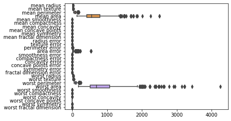
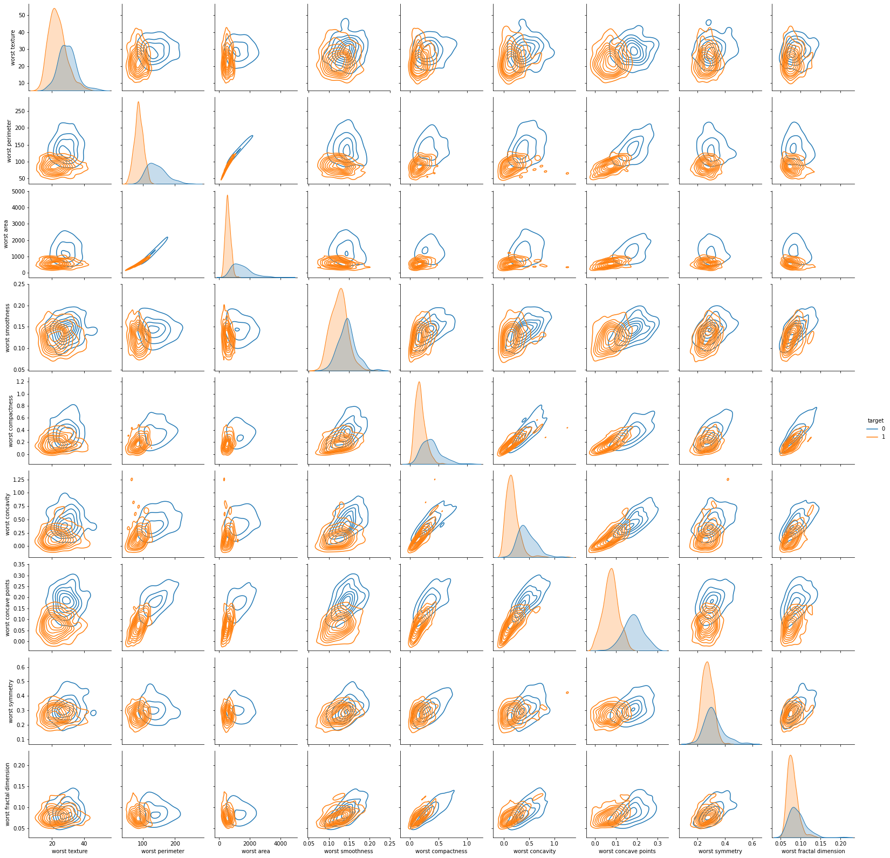
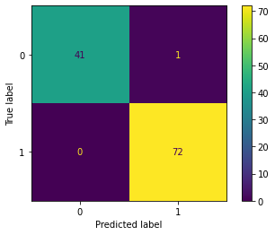
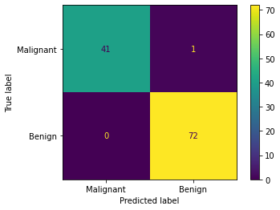

**Goal:**

Apply the logistic regression model to the breast cancer dataset

**Load Data:**


```python
import pandas as pd
import numpy as np
import seaborn as sns
import matplotlib.pyplot as plt
%matplotlib inline

from sklearn.linear_model import LogisticRegression
from sklearn.datasets import load_breast_cancer
from sklearn.preprocessing import StandardScaler
from sklearn.model_selection import train_test_split, GridSearchCV
from sklearn.pipeline import Pipeline
from sklearn.metrics import classification_report, confusion_matrix, plot_confusion_matrix, ConfusionMatrixDisplay
```


```python
data_dict = load_breast_cancer()
```


```python
X = pd.DataFrame(data_dict['data'], columns=data_dict['feature_names'])
y = pd.DataFrame(data_dict['target'], columns=['target'])
```

**EDA (1):**

It is important to set aside a test set at this stage to avoid data leakage, but the data has to be explored for imbalances to see if stratified samples would be best; hence EDA (1).


```python
y.value_counts(normalize=True)
```


    target
    1         0.627417
    0         0.372583
    dtype: float64


There is a notable imbalance so time to put aside the test set with stratified samples.


```python
# create train and test sets
X_train, X_test, y_train, y_test = train_test_split(X, y, test_size=.20, random_state=28, stratify=y)
```

**EDA (2):**


```python
pd.options.display.max_columns=100
display(X_train.head())
display(y_train.head())
```


<div>
<style scoped>
    .dataframe tbody tr th:only-of-type {
        vertical-align: middle;
    }

    .dataframe tbody tr th {
        vertical-align: top;
    }

    .dataframe thead th {
        text-align: right;
    }
</style>
<table border="1" class="dataframe">
  <thead>
    <tr style="text-align: right;">
      <th></th>
      <th>mean radius</th>
      <th>mean texture</th>
      <th>mean perimeter</th>
      <th>mean area</th>
      <th>mean smoothness</th>
      <th>mean compactness</th>
      <th>mean concavity</th>
      <th>mean concave points</th>
      <th>mean symmetry</th>
      <th>mean fractal dimension</th>
      <th>radius error</th>
      <th>texture error</th>
      <th>perimeter error</th>
      <th>area error</th>
      <th>smoothness error</th>
      <th>compactness error</th>
      <th>concavity error</th>
      <th>concave points error</th>
      <th>symmetry error</th>
      <th>fractal dimension error</th>
      <th>worst radius</th>
      <th>worst texture</th>
      <th>worst perimeter</th>
      <th>worst area</th>
      <th>worst smoothness</th>
      <th>worst compactness</th>
      <th>worst concavity</th>
      <th>worst concave points</th>
      <th>worst symmetry</th>
      <th>worst fractal dimension</th>
    </tr>
  </thead>
  <tbody>
    <tr>
      <th>267</th>
      <td>13.59</td>
      <td>21.84</td>
      <td>87.16</td>
      <td>561.0</td>
      <td>0.07956</td>
      <td>0.08259</td>
      <td>0.040720</td>
      <td>0.021420</td>
      <td>0.1635</td>
      <td>0.05859</td>
      <td>0.3380</td>
      <td>1.9160</td>
      <td>2.591</td>
      <td>26.76</td>
      <td>0.005436</td>
      <td>0.02406</td>
      <td>0.030990</td>
      <td>0.009919</td>
      <td>0.02030</td>
      <td>0.003009</td>
      <td>14.80</td>
      <td>30.04</td>
      <td>97.66</td>
      <td>661.5</td>
      <td>0.1005</td>
      <td>0.17300</td>
      <td>0.14530</td>
      <td>0.06189</td>
      <td>0.2446</td>
      <td>0.07024</td>
    </tr>
    <tr>
      <th>154</th>
      <td>13.15</td>
      <td>15.34</td>
      <td>85.31</td>
      <td>538.9</td>
      <td>0.09384</td>
      <td>0.08498</td>
      <td>0.092930</td>
      <td>0.034830</td>
      <td>0.1822</td>
      <td>0.06207</td>
      <td>0.2710</td>
      <td>0.7927</td>
      <td>1.819</td>
      <td>22.79</td>
      <td>0.008584</td>
      <td>0.02017</td>
      <td>0.030470</td>
      <td>0.009536</td>
      <td>0.02769</td>
      <td>0.003479</td>
      <td>14.77</td>
      <td>20.50</td>
      <td>97.67</td>
      <td>677.3</td>
      <td>0.1478</td>
      <td>0.22560</td>
      <td>0.30090</td>
      <td>0.09722</td>
      <td>0.3849</td>
      <td>0.08633</td>
    </tr>
    <tr>
      <th>310</th>
      <td>11.70</td>
      <td>19.11</td>
      <td>74.33</td>
      <td>418.7</td>
      <td>0.08814</td>
      <td>0.05253</td>
      <td>0.015830</td>
      <td>0.011480</td>
      <td>0.1936</td>
      <td>0.06128</td>
      <td>0.1601</td>
      <td>1.4300</td>
      <td>1.109</td>
      <td>11.28</td>
      <td>0.006064</td>
      <td>0.00911</td>
      <td>0.010420</td>
      <td>0.007638</td>
      <td>0.02349</td>
      <td>0.001661</td>
      <td>12.61</td>
      <td>26.55</td>
      <td>80.92</td>
      <td>483.1</td>
      <td>0.1223</td>
      <td>0.10870</td>
      <td>0.07915</td>
      <td>0.05741</td>
      <td>0.3487</td>
      <td>0.06958</td>
    </tr>
    <tr>
      <th>122</th>
      <td>24.25</td>
      <td>20.20</td>
      <td>166.20</td>
      <td>1761.0</td>
      <td>0.14470</td>
      <td>0.28670</td>
      <td>0.426800</td>
      <td>0.201200</td>
      <td>0.2655</td>
      <td>0.06877</td>
      <td>1.5090</td>
      <td>3.1200</td>
      <td>9.807</td>
      <td>233.00</td>
      <td>0.023330</td>
      <td>0.09806</td>
      <td>0.127800</td>
      <td>0.018220</td>
      <td>0.04547</td>
      <td>0.009875</td>
      <td>26.02</td>
      <td>23.99</td>
      <td>180.90</td>
      <td>2073.0</td>
      <td>0.1696</td>
      <td>0.42440</td>
      <td>0.58030</td>
      <td>0.22480</td>
      <td>0.3222</td>
      <td>0.08009</td>
    </tr>
    <tr>
      <th>332</th>
      <td>11.22</td>
      <td>19.86</td>
      <td>71.94</td>
      <td>387.3</td>
      <td>0.10540</td>
      <td>0.06779</td>
      <td>0.005006</td>
      <td>0.007583</td>
      <td>0.1940</td>
      <td>0.06028</td>
      <td>0.2976</td>
      <td>1.9660</td>
      <td>1.959</td>
      <td>19.62</td>
      <td>0.012890</td>
      <td>0.01104</td>
      <td>0.003297</td>
      <td>0.004967</td>
      <td>0.04243</td>
      <td>0.001963</td>
      <td>11.98</td>
      <td>25.78</td>
      <td>76.91</td>
      <td>436.1</td>
      <td>0.1424</td>
      <td>0.09669</td>
      <td>0.01335</td>
      <td>0.02022</td>
      <td>0.3292</td>
      <td>0.06522</td>
    </tr>
  </tbody>
</table>
</div>


<div>
<style scoped>
    .dataframe tbody tr th:only-of-type {
        vertical-align: middle;
    }

    .dataframe tbody tr th {
        vertical-align: top;
    }

    .dataframe thead th {
        text-align: right;
    }
</style>
<table border="1" class="dataframe">
  <thead>
    <tr style="text-align: right;">
      <th></th>
      <th>target</th>
    </tr>
  </thead>
  <tbody>
    <tr>
      <th>267</th>
      <td>1</td>
    </tr>
    <tr>
      <th>154</th>
      <td>1</td>
    </tr>
    <tr>
      <th>310</th>
      <td>1</td>
    </tr>
    <tr>
      <th>122</th>
      <td>0</td>
    </tr>
    <tr>
      <th>332</th>
      <td>1</td>
    </tr>
  </tbody>
</table>
</div>


```python
X_train.describe()
```


<div>
<style scoped>
    .dataframe tbody tr th:only-of-type {
        vertical-align: middle;
    }

    .dataframe tbody tr th {
        vertical-align: top;
    }

    .dataframe thead th {
        text-align: right;
    }
</style>
<table border="1" class="dataframe">
  <thead>
    <tr style="text-align: right;">
      <th></th>
      <th>mean radius</th>
      <th>mean texture</th>
      <th>mean perimeter</th>
      <th>mean area</th>
      <th>mean smoothness</th>
      <th>mean compactness</th>
      <th>mean concavity</th>
      <th>mean concave points</th>
      <th>mean symmetry</th>
      <th>mean fractal dimension</th>
      <th>radius error</th>
      <th>texture error</th>
      <th>perimeter error</th>
      <th>area error</th>
      <th>smoothness error</th>
      <th>compactness error</th>
      <th>concavity error</th>
      <th>concave points error</th>
      <th>symmetry error</th>
      <th>fractal dimension error</th>
      <th>worst radius</th>
      <th>worst texture</th>
      <th>worst perimeter</th>
      <th>worst area</th>
      <th>worst smoothness</th>
      <th>worst compactness</th>
      <th>worst concavity</th>
      <th>worst concave points</th>
      <th>worst symmetry</th>
      <th>worst fractal dimension</th>
    </tr>
  </thead>
  <tbody>
    <tr>
      <th>count</th>
      <td>455.000000</td>
      <td>455.000000</td>
      <td>455.000000</td>
      <td>455.000000</td>
      <td>455.000000</td>
      <td>455.000000</td>
      <td>455.000000</td>
      <td>455.000000</td>
      <td>455.000000</td>
      <td>455.000000</td>
      <td>455.000000</td>
      <td>455.000000</td>
      <td>455.000000</td>
      <td>455.000000</td>
      <td>455.000000</td>
      <td>455.000000</td>
      <td>455.000000</td>
      <td>455.000000</td>
      <td>455.000000</td>
      <td>455.000000</td>
      <td>455.000000</td>
      <td>455.000000</td>
      <td>455.000000</td>
      <td>455.000000</td>
      <td>455.000000</td>
      <td>455.000000</td>
      <td>455.000000</td>
      <td>455.000000</td>
      <td>455.000000</td>
      <td>455.000000</td>
    </tr>
    <tr>
      <th>mean</th>
      <td>14.208224</td>
      <td>19.309363</td>
      <td>92.523033</td>
      <td>664.190110</td>
      <td>0.096184</td>
      <td>0.104225</td>
      <td>0.089821</td>
      <td>0.049322</td>
      <td>0.180867</td>
      <td>0.062600</td>
      <td>0.409321</td>
      <td>1.207593</td>
      <td>2.890140</td>
      <td>41.518136</td>
      <td>0.007037</td>
      <td>0.025404</td>
      <td>0.032184</td>
      <td>0.011794</td>
      <td>0.020385</td>
      <td>0.003769</td>
      <td>16.370152</td>
      <td>25.643275</td>
      <td>107.971011</td>
      <td>896.525934</td>
      <td>0.131921</td>
      <td>0.253225</td>
      <td>0.274383</td>
      <td>0.115305</td>
      <td>0.288969</td>
      <td>0.083461</td>
    </tr>
    <tr>
      <th>std</th>
      <td>3.599539</td>
      <td>4.367548</td>
      <td>24.844850</td>
      <td>364.571393</td>
      <td>0.014049</td>
      <td>0.052249</td>
      <td>0.081708</td>
      <td>0.039482</td>
      <td>0.026790</td>
      <td>0.006829</td>
      <td>0.289713</td>
      <td>0.552007</td>
      <td>2.097842</td>
      <td>48.866145</td>
      <td>0.003136</td>
      <td>0.017505</td>
      <td>0.031551</td>
      <td>0.006117</td>
      <td>0.008182</td>
      <td>0.002678</td>
      <td>4.961352</td>
      <td>6.217853</td>
      <td>34.541306</td>
      <td>594.625227</td>
      <td>0.022897</td>
      <td>0.154289</td>
      <td>0.210332</td>
      <td>0.065869</td>
      <td>0.058213</td>
      <td>0.017552</td>
    </tr>
    <tr>
      <th>min</th>
      <td>6.981000</td>
      <td>9.710000</td>
      <td>43.790000</td>
      <td>143.500000</td>
      <td>0.052630</td>
      <td>0.019380</td>
      <td>0.000000</td>
      <td>0.000000</td>
      <td>0.106000</td>
      <td>0.049960</td>
      <td>0.111500</td>
      <td>0.360200</td>
      <td>0.757000</td>
      <td>6.802000</td>
      <td>0.001713</td>
      <td>0.002252</td>
      <td>0.000000</td>
      <td>0.000000</td>
      <td>0.007882</td>
      <td>0.000895</td>
      <td>7.930000</td>
      <td>12.020000</td>
      <td>50.410000</td>
      <td>185.200000</td>
      <td>0.071170</td>
      <td>0.027290</td>
      <td>0.000000</td>
      <td>0.000000</td>
      <td>0.156500</td>
      <td>0.055040</td>
    </tr>
    <tr>
      <th>25%</th>
      <td>11.675000</td>
      <td>16.165000</td>
      <td>74.795000</td>
      <td>417.950000</td>
      <td>0.085855</td>
      <td>0.066160</td>
      <td>0.030410</td>
      <td>0.020455</td>
      <td>0.162100</td>
      <td>0.057490</td>
      <td>0.234100</td>
      <td>0.823700</td>
      <td>1.609000</td>
      <td>17.860000</td>
      <td>0.005036</td>
      <td>0.013535</td>
      <td>0.015435</td>
      <td>0.007909</td>
      <td>0.015015</td>
      <td>0.002178</td>
      <td>12.980000</td>
      <td>21.005000</td>
      <td>83.945000</td>
      <td>512.800000</td>
      <td>0.116600</td>
      <td>0.147950</td>
      <td>0.120350</td>
      <td>0.065225</td>
      <td>0.251350</td>
      <td>0.070920</td>
    </tr>
    <tr>
      <th>50%</th>
      <td>13.450000</td>
      <td>18.870000</td>
      <td>86.870000</td>
      <td>557.200000</td>
      <td>0.096390</td>
      <td>0.093620</td>
      <td>0.061550</td>
      <td>0.033500</td>
      <td>0.178800</td>
      <td>0.061540</td>
      <td>0.324900</td>
      <td>1.095000</td>
      <td>2.304000</td>
      <td>24.720000</td>
      <td>0.006272</td>
      <td>0.020030</td>
      <td>0.025860</td>
      <td>0.010900</td>
      <td>0.018700</td>
      <td>0.003114</td>
      <td>14.990000</td>
      <td>25.270000</td>
      <td>97.960000</td>
      <td>694.400000</td>
      <td>0.131300</td>
      <td>0.211300</td>
      <td>0.226000</td>
      <td>0.100100</td>
      <td>0.282900</td>
      <td>0.080090</td>
    </tr>
    <tr>
      <th>75%</th>
      <td>15.935000</td>
      <td>21.825000</td>
      <td>104.700000</td>
      <td>790.850000</td>
      <td>0.105700</td>
      <td>0.129400</td>
      <td>0.121500</td>
      <td>0.073820</td>
      <td>0.195650</td>
      <td>0.066120</td>
      <td>0.477850</td>
      <td>1.469000</td>
      <td>3.376500</td>
      <td>45.390000</td>
      <td>0.008156</td>
      <td>0.032295</td>
      <td>0.042565</td>
      <td>0.014710</td>
      <td>0.023145</td>
      <td>0.004572</td>
      <td>18.775000</td>
      <td>29.880000</td>
      <td>125.250000</td>
      <td>1077.000000</td>
      <td>0.145800</td>
      <td>0.328050</td>
      <td>0.381900</td>
      <td>0.162650</td>
      <td>0.317150</td>
      <td>0.091825</td>
    </tr>
    <tr>
      <th>max</th>
      <td>28.110000</td>
      <td>39.280000</td>
      <td>188.500000</td>
      <td>2501.000000</td>
      <td>0.144700</td>
      <td>0.345400</td>
      <td>0.426800</td>
      <td>0.201200</td>
      <td>0.290600</td>
      <td>0.095750</td>
      <td>2.873000</td>
      <td>4.885000</td>
      <td>21.980000</td>
      <td>542.200000</td>
      <td>0.031130</td>
      <td>0.106400</td>
      <td>0.396000</td>
      <td>0.052790</td>
      <td>0.078950</td>
      <td>0.029840</td>
      <td>36.040000</td>
      <td>49.540000</td>
      <td>251.200000</td>
      <td>4254.000000</td>
      <td>0.222600</td>
      <td>1.058000</td>
      <td>1.252000</td>
      <td>0.291000</td>
      <td>0.577400</td>
      <td>0.207500</td>
    </tr>
  </tbody>
</table>
</div>


The scale of the data is very different. Scaling is necessary prior to fitting the model.


```python
# a quick boxplot to check for egregious outliers
sns.boxplot(data=X_train, orient='h')
plt.show()
```





While the *mean area* and *worst area* columns have large values and what appears to be a lot of outliers, it sort of makes sense because these columns are correlated. Larger values for worst area would result in larger means for the area. No values need to be removed, but again scaling is necessary.


```python
plotdata = pd.concat([X_train, y_train], axis='columns')
plotdata.head()
```


<div>
<style scoped>
    .dataframe tbody tr th:only-of-type {
        vertical-align: middle;
    }

    .dataframe tbody tr th {
        vertical-align: top;
    }

    .dataframe thead th {
        text-align: right;
    }
</style>
<table border="1" class="dataframe">
  <thead>
    <tr style="text-align: right;">
      <th></th>
      <th>mean radius</th>
      <th>mean texture</th>
      <th>mean perimeter</th>
      <th>mean area</th>
      <th>mean smoothness</th>
      <th>mean compactness</th>
      <th>mean concavity</th>
      <th>mean concave points</th>
      <th>mean symmetry</th>
      <th>mean fractal dimension</th>
      <th>radius error</th>
      <th>texture error</th>
      <th>perimeter error</th>
      <th>area error</th>
      <th>smoothness error</th>
      <th>compactness error</th>
      <th>concavity error</th>
      <th>concave points error</th>
      <th>symmetry error</th>
      <th>fractal dimension error</th>
      <th>worst radius</th>
      <th>worst texture</th>
      <th>worst perimeter</th>
      <th>worst area</th>
      <th>worst smoothness</th>
      <th>worst compactness</th>
      <th>worst concavity</th>
      <th>worst concave points</th>
      <th>worst symmetry</th>
      <th>worst fractal dimension</th>
      <th>target</th>
    </tr>
  </thead>
  <tbody>
    <tr>
      <th>267</th>
      <td>13.59</td>
      <td>21.84</td>
      <td>87.16</td>
      <td>561.0</td>
      <td>0.07956</td>
      <td>0.08259</td>
      <td>0.040720</td>
      <td>0.021420</td>
      <td>0.1635</td>
      <td>0.05859</td>
      <td>0.3380</td>
      <td>1.9160</td>
      <td>2.591</td>
      <td>26.76</td>
      <td>0.005436</td>
      <td>0.02406</td>
      <td>0.030990</td>
      <td>0.009919</td>
      <td>0.02030</td>
      <td>0.003009</td>
      <td>14.80</td>
      <td>30.04</td>
      <td>97.66</td>
      <td>661.5</td>
      <td>0.1005</td>
      <td>0.17300</td>
      <td>0.14530</td>
      <td>0.06189</td>
      <td>0.2446</td>
      <td>0.07024</td>
      <td>1</td>
    </tr>
    <tr>
      <th>154</th>
      <td>13.15</td>
      <td>15.34</td>
      <td>85.31</td>
      <td>538.9</td>
      <td>0.09384</td>
      <td>0.08498</td>
      <td>0.092930</td>
      <td>0.034830</td>
      <td>0.1822</td>
      <td>0.06207</td>
      <td>0.2710</td>
      <td>0.7927</td>
      <td>1.819</td>
      <td>22.79</td>
      <td>0.008584</td>
      <td>0.02017</td>
      <td>0.030470</td>
      <td>0.009536</td>
      <td>0.02769</td>
      <td>0.003479</td>
      <td>14.77</td>
      <td>20.50</td>
      <td>97.67</td>
      <td>677.3</td>
      <td>0.1478</td>
      <td>0.22560</td>
      <td>0.30090</td>
      <td>0.09722</td>
      <td>0.3849</td>
      <td>0.08633</td>
      <td>1</td>
    </tr>
    <tr>
      <th>310</th>
      <td>11.70</td>
      <td>19.11</td>
      <td>74.33</td>
      <td>418.7</td>
      <td>0.08814</td>
      <td>0.05253</td>
      <td>0.015830</td>
      <td>0.011480</td>
      <td>0.1936</td>
      <td>0.06128</td>
      <td>0.1601</td>
      <td>1.4300</td>
      <td>1.109</td>
      <td>11.28</td>
      <td>0.006064</td>
      <td>0.00911</td>
      <td>0.010420</td>
      <td>0.007638</td>
      <td>0.02349</td>
      <td>0.001661</td>
      <td>12.61</td>
      <td>26.55</td>
      <td>80.92</td>
      <td>483.1</td>
      <td>0.1223</td>
      <td>0.10870</td>
      <td>0.07915</td>
      <td>0.05741</td>
      <td>0.3487</td>
      <td>0.06958</td>
      <td>1</td>
    </tr>
    <tr>
      <th>122</th>
      <td>24.25</td>
      <td>20.20</td>
      <td>166.20</td>
      <td>1761.0</td>
      <td>0.14470</td>
      <td>0.28670</td>
      <td>0.426800</td>
      <td>0.201200</td>
      <td>0.2655</td>
      <td>0.06877</td>
      <td>1.5090</td>
      <td>3.1200</td>
      <td>9.807</td>
      <td>233.00</td>
      <td>0.023330</td>
      <td>0.09806</td>
      <td>0.127800</td>
      <td>0.018220</td>
      <td>0.04547</td>
      <td>0.009875</td>
      <td>26.02</td>
      <td>23.99</td>
      <td>180.90</td>
      <td>2073.0</td>
      <td>0.1696</td>
      <td>0.42440</td>
      <td>0.58030</td>
      <td>0.22480</td>
      <td>0.3222</td>
      <td>0.08009</td>
      <td>0</td>
    </tr>
    <tr>
      <th>332</th>
      <td>11.22</td>
      <td>19.86</td>
      <td>71.94</td>
      <td>387.3</td>
      <td>0.10540</td>
      <td>0.06779</td>
      <td>0.005006</td>
      <td>0.007583</td>
      <td>0.1940</td>
      <td>0.06028</td>
      <td>0.2976</td>
      <td>1.9660</td>
      <td>1.959</td>
      <td>19.62</td>
      <td>0.012890</td>
      <td>0.01104</td>
      <td>0.003297</td>
      <td>0.004967</td>
      <td>0.04243</td>
      <td>0.001963</td>
      <td>11.98</td>
      <td>25.78</td>
      <td>76.91</td>
      <td>436.1</td>
      <td>0.1424</td>
      <td>0.09669</td>
      <td>0.01335</td>
      <td>0.02022</td>
      <td>0.3292</td>
      <td>0.06522</td>
      <td>1</td>
    </tr>
  </tbody>
</table>
</div>


```python
sns.pairplot(data=plotdata.iloc[:,21::], hue='target', kind='kde')
plt.show()
```





**Modeling**


```python
# set up the model steps
# 1-scaling, 2-logistic regression modeling
steps = [('scaler',StandardScaler()),('lr',LogisticRegression())]

# create the pipeline using steps and custom names for the steps
lr_pipeline = Pipeline(steps)

# set up the parameters of the model to search over
parameters = {'lr__penalty':['l1', 'l2'],
              'lr__C':[.001, .01, .1, 1],
              'lr__class_weight':['balanced', None],
              'lr__solver':['liblinear']}

# model
lr_model = GridSearchCV(lr_pipeline, parameters, cv=5)
lr_model
```


    GridSearchCV(cv=5,
                 estimator=Pipeline(steps=[('scaler', StandardScaler()),
                                           ('lr', LogisticRegression())]),
                 param_grid={'lr__C': [0.001, 0.01, 0.1, 1],
                             'lr__class_weight': ['balanced', None],
                             'lr__penalty': ['l1', 'l2'],
                             'lr__solver': ['liblinear']})


```python
# fit the model
lr_model.fit(X_train.values, y_train.values.ravel())
```


    GridSearchCV(cv=5,
                 estimator=Pipeline(steps=[('scaler', StandardScaler()),
                                           ('lr', LogisticRegression())]),
                 param_grid={'lr__C': [0.001, 0.01, 0.1, 1],
                             'lr__class_weight': ['balanced', None],
                             'lr__penalty': ['l1', 'l2'],
                             'lr__solver': ['liblinear']})


```python
# the best model
lr_model.best_estimator_
```


    Pipeline(steps=[('scaler', StandardScaler()),
                    ('lr', LogisticRegression(C=0.1, solver='liblinear'))])


The best model here shows that using default parameter values for penalty and class weghts, and the liblinear solver produced the best output via stratified cross-validation. The following shows the cv results dataframe for the best estimator identified via the grid search object.


```python
display(pd.DataFrame(lr_model.cv_results_))
```


<div>
<style scoped>
    .dataframe tbody tr th:only-of-type {
        vertical-align: middle;
    }

    .dataframe tbody tr th {
        vertical-align: top;
    }

    .dataframe thead th {
        text-align: right;
    }
</style>
<table border="1" class="dataframe">
  <thead>
    <tr style="text-align: right;">
      <th></th>
      <th>mean_fit_time</th>
      <th>std_fit_time</th>
      <th>mean_score_time</th>
      <th>std_score_time</th>
      <th>param_lr__C</th>
      <th>param_lr__class_weight</th>
      <th>param_lr__penalty</th>
      <th>param_lr__solver</th>
      <th>params</th>
      <th>split0_test_score</th>
      <th>split1_test_score</th>
      <th>split2_test_score</th>
      <th>split3_test_score</th>
      <th>split4_test_score</th>
      <th>mean_test_score</th>
      <th>std_test_score</th>
      <th>rank_test_score</th>
    </tr>
  </thead>
  <tbody>
    <tr>
      <th>0</th>
      <td>0.002227</td>
      <td>0.000132</td>
      <td>0.000673</td>
      <td>0.000132</td>
      <td>0.001</td>
      <td>balanced</td>
      <td>l1</td>
      <td>liblinear</td>
      <td>{'lr__C': 0.001, 'lr__class_weight': 'balanced...</td>
      <td>0.373626</td>
      <td>0.373626</td>
      <td>0.373626</td>
      <td>0.373626</td>
      <td>0.373626</td>
      <td>0.373626</td>
      <td>0.000000</td>
      <td>15</td>
    </tr>
    <tr>
      <th>1</th>
      <td>0.002761</td>
      <td>0.000169</td>
      <td>0.000791</td>
      <td>0.000248</td>
      <td>0.001</td>
      <td>balanced</td>
      <td>l2</td>
      <td>liblinear</td>
      <td>{'lr__C': 0.001, 'lr__class_weight': 'balanced...</td>
      <td>0.934066</td>
      <td>0.967033</td>
      <td>0.945055</td>
      <td>0.945055</td>
      <td>0.923077</td>
      <td>0.942857</td>
      <td>0.014579</td>
      <td>11</td>
    </tr>
    <tr>
      <th>2</th>
      <td>0.001681</td>
      <td>0.000323</td>
      <td>0.000563</td>
      <td>0.000225</td>
      <td>0.001</td>
      <td>None</td>
      <td>l1</td>
      <td>liblinear</td>
      <td>{'lr__C': 0.001, 'lr__class_weight': None, 'lr...</td>
      <td>0.373626</td>
      <td>0.373626</td>
      <td>0.373626</td>
      <td>0.373626</td>
      <td>0.373626</td>
      <td>0.373626</td>
      <td>0.000000</td>
      <td>15</td>
    </tr>
    <tr>
      <th>3</th>
      <td>0.001417</td>
      <td>0.000123</td>
      <td>0.000343</td>
      <td>0.000024</td>
      <td>0.001</td>
      <td>None</td>
      <td>l2</td>
      <td>liblinear</td>
      <td>{'lr__C': 0.001, 'lr__class_weight': None, 'lr...</td>
      <td>0.912088</td>
      <td>0.967033</td>
      <td>0.956044</td>
      <td>0.912088</td>
      <td>0.934066</td>
      <td>0.936264</td>
      <td>0.022413</td>
      <td>12</td>
    </tr>
    <tr>
      <th>4</th>
      <td>0.002136</td>
      <td>0.000140</td>
      <td>0.000424</td>
      <td>0.000087</td>
      <td>0.01</td>
      <td>balanced</td>
      <td>l1</td>
      <td>liblinear</td>
      <td>{'lr__C': 0.01, 'lr__class_weight': 'balanced'...</td>
      <td>0.901099</td>
      <td>0.923077</td>
      <td>0.912088</td>
      <td>0.945055</td>
      <td>0.879121</td>
      <td>0.912088</td>
      <td>0.021978</td>
      <td>14</td>
    </tr>
    <tr>
      <th>5</th>
      <td>0.005018</td>
      <td>0.005448</td>
      <td>0.000643</td>
      <td>0.000206</td>
      <td>0.01</td>
      <td>balanced</td>
      <td>l2</td>
      <td>liblinear</td>
      <td>{'lr__C': 0.01, 'lr__class_weight': 'balanced'...</td>
      <td>0.956044</td>
      <td>0.978022</td>
      <td>0.978022</td>
      <td>0.945055</td>
      <td>0.956044</td>
      <td>0.962637</td>
      <td>0.013187</td>
      <td>9</td>
    </tr>
    <tr>
      <th>6</th>
      <td>0.002407</td>
      <td>0.000563</td>
      <td>0.000540</td>
      <td>0.000208</td>
      <td>0.01</td>
      <td>None</td>
      <td>l1</td>
      <td>liblinear</td>
      <td>{'lr__C': 0.01, 'lr__class_weight': None, 'lr_...</td>
      <td>0.901099</td>
      <td>0.934066</td>
      <td>0.912088</td>
      <td>0.945055</td>
      <td>0.879121</td>
      <td>0.914286</td>
      <td>0.023466</td>
      <td>13</td>
    </tr>
    <tr>
      <th>7</th>
      <td>0.001878</td>
      <td>0.000160</td>
      <td>0.000406</td>
      <td>0.000023</td>
      <td>0.01</td>
      <td>None</td>
      <td>l2</td>
      <td>liblinear</td>
      <td>{'lr__C': 0.01, 'lr__class_weight': None, 'lr_...</td>
      <td>0.945055</td>
      <td>0.989011</td>
      <td>0.967033</td>
      <td>0.945055</td>
      <td>0.945055</td>
      <td>0.958242</td>
      <td>0.017582</td>
      <td>10</td>
    </tr>
    <tr>
      <th>8</th>
      <td>0.001866</td>
      <td>0.000141</td>
      <td>0.000339</td>
      <td>0.000020</td>
      <td>0.1</td>
      <td>balanced</td>
      <td>l1</td>
      <td>liblinear</td>
      <td>{'lr__C': 0.1, 'lr__class_weight': 'balanced',...</td>
      <td>0.956044</td>
      <td>0.978022</td>
      <td>0.956044</td>
      <td>0.989011</td>
      <td>0.956044</td>
      <td>0.967033</td>
      <td>0.013900</td>
      <td>8</td>
    </tr>
    <tr>
      <th>9</th>
      <td>0.001891</td>
      <td>0.000133</td>
      <td>0.000326</td>
      <td>0.000012</td>
      <td>0.1</td>
      <td>balanced</td>
      <td>l2</td>
      <td>liblinear</td>
      <td>{'lr__C': 0.1, 'lr__class_weight': 'balanced',...</td>
      <td>0.978022</td>
      <td>0.989011</td>
      <td>0.967033</td>
      <td>0.978022</td>
      <td>0.967033</td>
      <td>0.975824</td>
      <td>0.008223</td>
      <td>4</td>
    </tr>
    <tr>
      <th>10</th>
      <td>0.001682</td>
      <td>0.000101</td>
      <td>0.000314</td>
      <td>0.000010</td>
      <td>0.1</td>
      <td>None</td>
      <td>l1</td>
      <td>liblinear</td>
      <td>{'lr__C': 0.1, 'lr__class_weight': None, 'lr__...</td>
      <td>0.978022</td>
      <td>0.989011</td>
      <td>0.967033</td>
      <td>0.956044</td>
      <td>0.967033</td>
      <td>0.971429</td>
      <td>0.011207</td>
      <td>6</td>
    </tr>
    <tr>
      <th>11</th>
      <td>0.001662</td>
      <td>0.000140</td>
      <td>0.000300</td>
      <td>0.000008</td>
      <td>0.1</td>
      <td>None</td>
      <td>l2</td>
      <td>liblinear</td>
      <td>{'lr__C': 0.1, 'lr__class_weight': None, 'lr__...</td>
      <td>0.989011</td>
      <td>0.989011</td>
      <td>0.967033</td>
      <td>0.978022</td>
      <td>0.967033</td>
      <td>0.978022</td>
      <td>0.009829</td>
      <td>1</td>
    </tr>
    <tr>
      <th>12</th>
      <td>0.002521</td>
      <td>0.000377</td>
      <td>0.000385</td>
      <td>0.000073</td>
      <td>1</td>
      <td>balanced</td>
      <td>l1</td>
      <td>liblinear</td>
      <td>{'lr__C': 1, 'lr__class_weight': 'balanced', '...</td>
      <td>0.967033</td>
      <td>1.000000</td>
      <td>0.967033</td>
      <td>0.989011</td>
      <td>0.967033</td>
      <td>0.978022</td>
      <td>0.013900</td>
      <td>1</td>
    </tr>
    <tr>
      <th>13</th>
      <td>0.002215</td>
      <td>0.000045</td>
      <td>0.000339</td>
      <td>0.000026</td>
      <td>1</td>
      <td>balanced</td>
      <td>l2</td>
      <td>liblinear</td>
      <td>{'lr__C': 1, 'lr__class_weight': 'balanced', '...</td>
      <td>0.978022</td>
      <td>0.978022</td>
      <td>0.956044</td>
      <td>0.978022</td>
      <td>0.967033</td>
      <td>0.971429</td>
      <td>0.008791</td>
      <td>7</td>
    </tr>
    <tr>
      <th>14</th>
      <td>0.002766</td>
      <td>0.000268</td>
      <td>0.000480</td>
      <td>0.000116</td>
      <td>1</td>
      <td>None</td>
      <td>l1</td>
      <td>liblinear</td>
      <td>{'lr__C': 1, 'lr__class_weight': None, 'lr__pe...</td>
      <td>0.956044</td>
      <td>1.000000</td>
      <td>0.967033</td>
      <td>0.989011</td>
      <td>0.967033</td>
      <td>0.975824</td>
      <td>0.016150</td>
      <td>4</td>
    </tr>
    <tr>
      <th>15</th>
      <td>0.002173</td>
      <td>0.000046</td>
      <td>0.000350</td>
      <td>0.000020</td>
      <td>1</td>
      <td>None</td>
      <td>l2</td>
      <td>liblinear</td>
      <td>{'lr__C': 1, 'lr__class_weight': None, 'lr__pe...</td>
      <td>0.978022</td>
      <td>1.000000</td>
      <td>0.978022</td>
      <td>0.967033</td>
      <td>0.967033</td>
      <td>0.978022</td>
      <td>0.012038</td>
      <td>1</td>
    </tr>
  </tbody>
</table>
</div>


```python
# get the predictions with the predict function
y_pred = lr_model.predict(X_test)
str(round(lr_model.best_score_,2)*100)+'% Accuracy'
```


    '98.0% Accuracy'


The confusion matrix is below:


```python
# manual confusion matrix calculation
cm = confusion_matrix(y_test, y_pred)
cm
```


    array([[41,  1],
           [ 0, 72]])


```python
# better visual for the confusion matrix
plot_confusion_matrix(lr_model, X_test, y_test)
plt.show()
```





The classification report is below:


```python
classification_report(y_test, y_pred).split('\n')
```


    ['              precision    recall  f1-score   support',
     '',
     '           0       1.00      0.98      0.99        42',
     '           1       0.99      1.00      0.99        72',
     '',
     '    accuracy                           0.99       114',
     '   macro avg       0.99      0.99      0.99       114',
     'weighted avg       0.99      0.99      0.99       114',
     '']


**The interpretation of the results are more important than model accuracy. Which label is for malignant vs. benign? Is the level of accuracy acceptable given that labeling?**


```python
data_dict.keys()
```


    dict_keys(['data', 'target', 'frame', 'target_names', 'DESCR', 'feature_names', 'filename'])


```python
data_dict['DESCR'].split('\n')
```


    ['.. _breast_cancer_dataset:',
     '',
     'Breast cancer wisconsin (diagnostic) dataset',
     '--------------------------------------------',
     '',
     '**Data Set Characteristics:**',
     '',
     '    :Number of Instances: 569',
     '',
     '    :Number of Attributes: 30 numeric, predictive attributes and the class',
     '',
     '    :Attribute Information:',
     '        - radius (mean of distances from center to points on the perimeter)',
     '        - texture (standard deviation of gray-scale values)',
     '        - perimeter',
     '        - area',
     '        - smoothness (local variation in radius lengths)',
     '        - compactness (perimeter^2 / area - 1.0)',
     '        - concavity (severity of concave portions of the contour)',
     '        - concave points (number of concave portions of the contour)',
     '        - symmetry',
     '        - fractal dimension ("coastline approximation" - 1)',
     '',
     '        The mean, standard error, and "worst" or largest (mean of the three',
     '        worst/largest values) of these features were computed for each image,',
     '        resulting in 30 features.  For instance, field 0 is Mean Radius, field',
     '        10 is Radius SE, field 20 is Worst Radius.',
     '',
     '        - class:',
     '                - WDBC-Malignant',
     '                - WDBC-Benign',
     '',
     '    :Summary Statistics:',
     '',
     '    ===================================== ====== ======',
     '                                           Min    Max',
     '    ===================================== ====== ======',
     '    radius (mean):                        6.981  28.11',
     '    texture (mean):                       9.71   39.28',
     '    perimeter (mean):                     43.79  188.5',
     '    area (mean):                          143.5  2501.0',
     '    smoothness (mean):                    0.053  0.163',
     '    compactness (mean):                   0.019  0.345',
     '    concavity (mean):                     0.0    0.427',
     '    concave points (mean):                0.0    0.201',
     '    symmetry (mean):                      0.106  0.304',
     '    fractal dimension (mean):             0.05   0.097',
     '    radius (standard error):              0.112  2.873',
     '    texture (standard error):             0.36   4.885',
     '    perimeter (standard error):           0.757  21.98',
     '    area (standard error):                6.802  542.2',
     '    smoothness (standard error):          0.002  0.031',
     '    compactness (standard error):         0.002  0.135',
     '    concavity (standard error):           0.0    0.396',
     '    concave points (standard error):      0.0    0.053',
     '    symmetry (standard error):            0.008  0.079',
     '    fractal dimension (standard error):   0.001  0.03',
     '    radius (worst):                       7.93   36.04',
     '    texture (worst):                      12.02  49.54',
     '    perimeter (worst):                    50.41  251.2',
     '    area (worst):                         185.2  4254.0',
     '    smoothness (worst):                   0.071  0.223',
     '    compactness (worst):                  0.027  1.058',
     '    concavity (worst):                    0.0    1.252',
     '    concave points (worst):               0.0    0.291',
     '    symmetry (worst):                     0.156  0.664',
     '    fractal dimension (worst):            0.055  0.208',
     '    ===================================== ====== ======',
     '',
     '    :Missing Attribute Values: None',
     '',
     '    :Class Distribution: 212 - Malignant, 357 - Benign',
     '',
     '    :Creator:  Dr. William H. Wolberg, W. Nick Street, Olvi L. Mangasarian',
     '',
     '    :Donor: Nick Street',
     '',
     '    :Date: November, 1995',
     '',
     'This is a copy of UCI ML Breast Cancer Wisconsin (Diagnostic) datasets.',
     'https://goo.gl/U2Uwz2',
     '',
     'Features are computed from a digitized image of a fine needle',
     'aspirate (FNA) of a breast mass.  They describe',
     'characteristics of the cell nuclei present in the image.',
     '',
     'Separating plane described above was obtained using',
     'Multisurface Method-Tree (MSM-T) [K. P. Bennett, "Decision Tree',
     'Construction Via Linear Programming." Proceedings of the 4th',
     'Midwest Artificial Intelligence and Cognitive Science Society,',
     'pp. 97-101, 1992], a classification method which uses linear',
     'programming to construct a decision tree.  Relevant features',
     'were selected using an exhaustive search in the space of 1-4',
     'features and 1-3 separating planes.',
     '',
     'The actual linear program used to obtain the separating plane',
     'in the 3-dimensional space is that described in:',
     '[K. P. Bennett and O. L. Mangasarian: "Robust Linear',
     'Programming Discrimination of Two Linearly Inseparable Sets",',
     'Optimization Methods and Software 1, 1992, 23-34].',
     '',
     'This database is also available through the UW CS ftp server:',
     '',
     'ftp ftp.cs.wisc.edu',
     'cd math-prog/cpo-dataset/machine-learn/WDBC/',
     '',
     '.. topic:: References',
     '',
     '   - W.N. Street, W.H. Wolberg and O.L. Mangasarian. Nuclear feature extraction ',
     '     for breast tumor diagnosis. IS&T/SPIE 1993 International Symposium on ',
     '     Electronic Imaging: Science and Technology, volume 1905, pages 861-870,',
     '     San Jose, CA, 1993.',
     '   - O.L. Mangasarian, W.N. Street and W.H. Wolberg. Breast cancer diagnosis and ',
     '     prognosis via linear programming. Operations Research, 43(4), pages 570-577, ',
     '     July-August 1995.',
     '   - W.H. Wolberg, W.N. Street, and O.L. Mangasarian. Machine learning techniques',
     '     to diagnose breast cancer from fine-needle aspirates. Cancer Letters 77 (1994) ',
     '     163-171.']


The above description states that there are 212 malignant samples and 357 benign. By matching this up with the data available we can determine for sure (opposed to assuming) which target value matches to the target name.


```python
pd.Series(data_dict['target']).value_counts()
```


    1    357
    0    212
    dtype: int64


This shows that here the positive value is actually zero. Which means the presence of a malignant breast tumor is identified by zero in predictions. Inspecting the classification report shows that for the business objective of predicting the presence of a malignant tumor, the accuracies are:

**Precision: 100%**

**Recall: 98%**

**F1-score: 99%**


```python
classification_report(y_test, y_pred).split('\n')
```


    ['              precision    recall  f1-score   support',
     '',
     '           0       1.00      0.98      0.99        42',
     '           1       0.99      1.00      0.99        72',
     '',
     '    accuracy                           0.99       114',
     '   macro avg       0.99      0.99      0.99       114',
     'weighted avg       0.99      0.99      0.99       114',
     '']


```python
# confusion matrix with ready to read labels
ConfusionMatrixDisplay(cm, display_labels=['Malignant','Benign']).plot()
plt.show()
```





### Conclusion
**This result is questionable from a business perspective because although we have a high precision, which means all the samples identified as malignant were in fact malignant, the recall allowed one to slip through the cracks. This would translate to a failure to identify a malignant sample for a patient which is unacceptable. The second iteration would be too change the class weights and in attempt to gain perfect recall even if the precision drops. It would be much better to identify a malignant sample when one is NOT present, than fail to identify a malignant sample when it in fact is.**


```python

```
